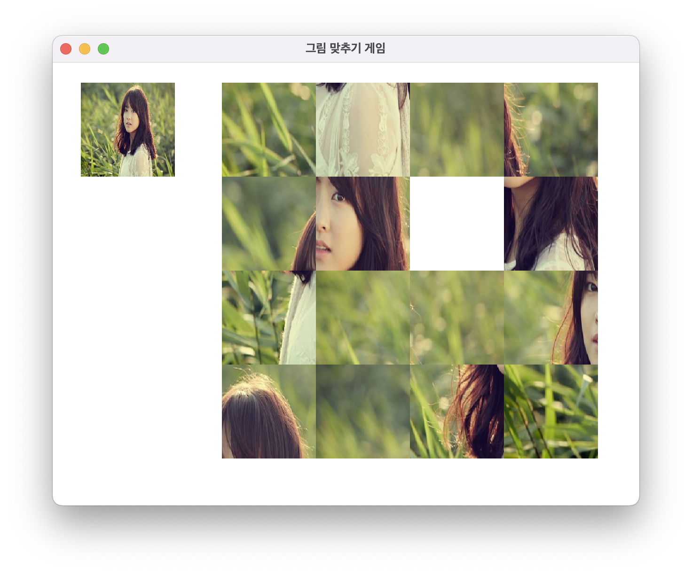

# 이미지 퍼즐 게임

깃허브 s0ry님의 파일을 가져와 해부해보며 공부한 자료입니다. 
덕분에 잘 공부한 것 같습니다. 감사합니다.
아래는 원본 파일 링크입니다. 
<link>
https://github.com/s0ry/2015_Image_puzzle
</link>

개요
-------------
15(4*4 -1)조각으로 나뉘어진 이미지를 움직여 맞추는 퍼즐 게임입니다.  
마우스를 클릭하여 조각을 이동시킬 수 있습니다.  
마우스 누르는 횟수와 시간을 기록합니다. 

+ JAVA
+ Intellij IDEA 

실행 결과
-------------
+ 게임시작

  

클래스 설계
-------------
+ P_frame.java
<pre><code>
public BufferedImage ori_img;		// 원본 이미지
public BufferedImage[][] sub_img = new BufferedImage[4][34;	// 분할 이미지 버퍼
public int[][] sub_index = new int[3][3];			// 분할 이미지 번호
P_ranking Pranking = new P_ranking();				// P_ranking 객체
Graphics g;				// paint()를 수행할 Graphics 객체	
int B_row, B_col;			// 빈 칸의 인덱스 
int M_count;				// 조각 옮긴 수
long S_Timer;				// 시작 시간
public long Timer;			// 걸린 시간

public void Create_Frame(){		// 프레임 생성
public void Create_Image(){		// 이미지 생성
public void Sub_Image(int m_piece){	// 이미지 분할 셋팅(조각 수)
public int Random_Setting(){		// 난수 반환
public void paint(Graphics g){		// Swing 의 JFrame을 상속한 클래스에서 paint()메소드를 오버라이드
public boolean Correct_clicked(int P_index){		// 클릭한 조각의 이동 가능 유무 반환(조각 위치 인덱스)
public BufferedImage Make_White(){			// 빈 칸 이미지 반환
public void Change_Image(int x, int y, int index){	// 조각 이미지 교환(이동)처리 함수(2차원 배열 x, 2차원 배열 y, 조각 위치 인덱스)
public boolean Check_Image(){			// 조각 맞추기 완성 체크
public void End_Game(){				// 게임 클리어
public void mousePressed(MouseEvent e) {	// 마우스 클릭 이벤트 처리
</code></pre>
